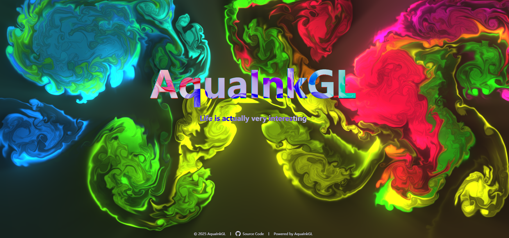

# AquaInkGL

AquaInkGL 是一个基于 **WebGL** 的水墨画背景特效项目，适用于个人主页。  
动态、流畅的墨迹扩散效果为网页带来独特的美感与沉浸体验。

## 预览




在线演示：[AquaInkGL Demo](https://wishmelz.github.io/AquaInkGL)

## 特性

- **流体水墨扩散动画**：灵感来自 [WebGL-Fluid-Simulation]，实现墨迹自然流动  
- **高性能渲染**：基于 WebGL 的 GPU 加速确保动画丝滑  
- **轻量易用**：无需构建，直接部署即可  
- **高度可定制**：可调整颜色、扩散速度、墨迹密度等参数

## 使用方法

1. **下载或克隆项目**
    ```bash
    git clone https://github.com/WishMelz/AquaInkGL.git
    ```

2. **部署到任意静态服务器**  
   - 本地查看：直接用浏览器打开 `index.html`  
   - 部署到 GitHub Pages、Vercel、Netlify 等平台即可上线


## 浏览器兼容性

兼容现代主流浏览器（Chrome、Firefox、Edge、Safari），需支持 WebGL。


## 致谢

- [PavelDoGreat/WebGL-Fluid-Simulation] 提供流体模拟核心算法
- 感谢所有点赞与 Fork 项目的朋友们
